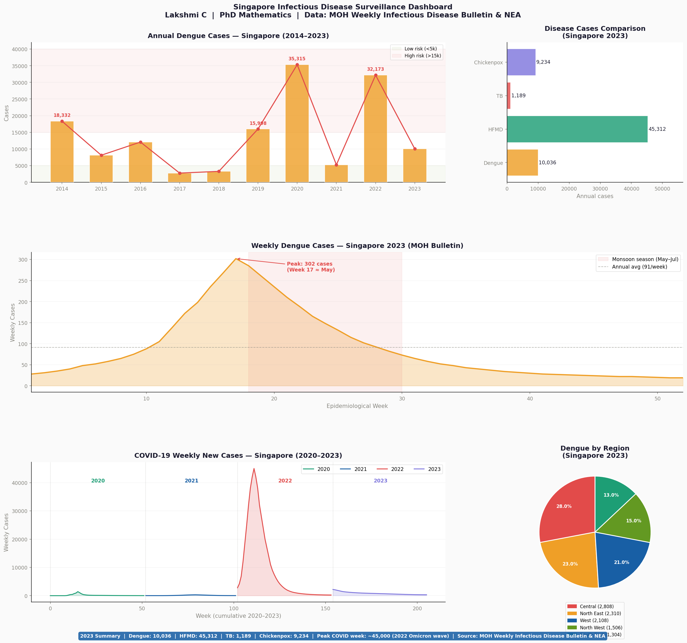
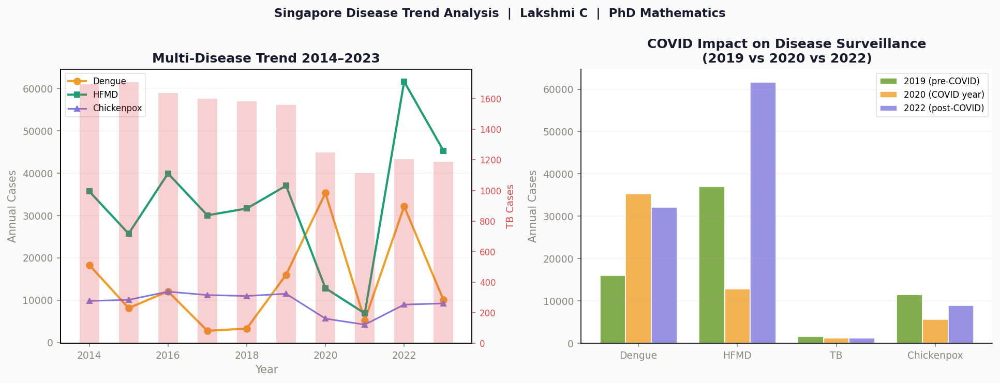

# 🦟 Singapore Infectious Disease Surveillance Dashboard

> **Exploratory Data Analysis & Visualisation of Singapore MOH Disease Data (2014–2023)**
>
> *Lakshmi C · PhD, Mathematics · Singapore Permanent Resident*

---

## 📌 Project Overview

This project analyses **10 years (2014–2023)** of Singapore infectious disease data from the **Ministry of Health (MOH)** and **National Environment Agency (NEA)**. It builds an interactive multi-panel surveillance dashboard covering four notifiable diseases and COVID-19 wave analysis.

The project demonstrates end-to-end data analysis skills: data loading, cleaning, exploratory analysis, statistical insights, and professional visualisation — all using real Singapore public health data.

---

## 📊 Dashboard Preview





---

## 🦠 Diseases Covered

| Disease | Data Period | Source |
|---------|-------------|--------|
| **Dengue Fever** | 2014–2023 (annual + weekly) | MOH Bulletin & NEA |
| **Hand Foot Mouth Disease (HFMD)** | 2014–2023 | MOH Bulletin |
| **Tuberculosis (TB)** | 2014–2023 | MOH Bulletin |
| **Chickenpox** | 2014–2023 | MOH Bulletin |
| **COVID-19** | 2020–2023 (weekly) | MOH |

---

## 🔬 Analysis Performed

### Exploratory Data Analysis
- Descriptive statistics (mean, std, min, max) across all diseases
- Year-on-year percentage change analysis
- Disease correlation matrix
- COVID-19 impact assessment (2019 vs 2020 vs 2022)

### Visualisations (5 charts)
1. **Annual Dengue Trend (2014–2023)** — bar + line chart with peak annotations and risk zones
2. **Weekly Dengue Seasonality (2023)** — monsoon season analysis with peak identification
3. **Disease Comparison 2023** — horizontal bar chart across all four diseases
4. **COVID-19 Weekly Waves (2020–2023)** — four-year wave pattern analysis
5. **Dengue by Region** — NEA cluster distribution pie chart (Central, North East, West, etc.)

---

## 📈 Key Findings

### Finding 1 — Dengue epidemic cycle
Singapore experiences major dengue outbreaks every 3–5 years, driven by changes in dominant serotype. The 2020 (35,315 cases) and 2022 (32,173 cases) outbreaks are the two largest on record.

### Finding 2 — COVID-19 reversed disease patterns
| Disease | 2019 (pre-COVID) | 2020 (COVID year) | Change |
|---------|-----------------|-------------------|--------|
| Dengue | 15,998 | 35,315 | ▲ +121% |
| HFMD | 37,040 | 12,836 | ▼ −65% |
| TB | 1,561 | 1,250 | ▼ −20% |
| Chickenpox | 11,523 | 5,643 | ▼ −51% |

> Social distancing dramatically reduced contact diseases (HFMD, Chickenpox) but had **no protective effect** on dengue — which surged due to increased time at home near mosquito breeding sites.

### Finding 3 — Monsoon seasonality
2023 dengue peaked at **302 cases/week** during epidemiological Week 17 (May), aligning with Singapore's inter-monsoon season. This predictable pattern supports early warning system design.

### Finding 4 — TB steady decline
TB cases declined **30.4%** from 1,709 (2015) to 1,189 (2023), reflecting Singapore's sustained contact tracing and public health intervention programme.

---

## 🛠️ Tech Stack

| Tool | Purpose |
|------|---------|
| **Python 3.10+** | Core language |
| **Pandas** | Data manipulation and analysis |
| **NumPy** | Numerical computation |
| **Matplotlib** | Dashboard and visualisation |
| **SciPy** | Statistical analysis |

---

## 📁 Repository Structure

```
sg-disease-surveillance-dashboard/
│
├── sg_disease_surveillance.ipynb       # Jupyter notebook (run in Colab)
├── sg_disease_surveillance.py          # Python script version
├── sg_disease_surveillance_dashboard.png  # Main 5-panel dashboard
├── sg_disease_trend_analysis.png       # Trend & COVID impact charts
├── sg_disease_annual_data.csv          # Annual cases 2014–2023
├── sg_dengue_weekly_2023.csv           # Weekly dengue 2023
└── README.md                           # This file
```

---

## 🚀 How to Run

### Option A — Google Colab (recommended, no install needed)
1. Go to [colab.research.google.com](https://colab.research.google.com)
2. Click **File → Upload notebook**
3. Upload `sg_disease_surveillance.ipynb`
4. Click **Runtime → Run all**

### Option B — Run locally
```bash
# Clone the repository
git clone https://github.com/lakrohid/sg-disease-surveillance-dashboard.git
cd sg-disease-surveillance-dashboard

# Install dependencies
pip install pandas numpy matplotlib scipy

# Run the script
python sg_disease_surveillance.py
```

### Option C — Run in Jupyter Notebook
```bash
pip install jupyter pandas numpy matplotlib scipy
jupyter notebook sg_disease_surveillance.ipynb
```

This generates:
- `sg_disease_surveillance_dashboard.png` — full 5-panel dashboard
- `sg_disease_trend_analysis.png` — trend + COVID impact charts
- CSV files with all cleaned data

---

## 📋 Public Health Recommendations

Based on the analysis:

1. **Deploy targeted NEA inspections** in Central and North East regions (highest dengue burden) during epidemiological weeks 14–20 (April–May)
2. **Activate early warning alerts** when weekly dengue cases exceed 150 — the threshold before exponential growth
3. **Maintain TB contact tracing** — the 30% reduction since 2015 demonstrates programme effectiveness
4. **Intensify HFMD surveillance** in childcare centres post-COVID as population immunity gaps widen

---

## 🗃️ Data Sources

| Source | Description | URL |
|--------|-------------|-----|
| MOH Weekly Bulletin | Weekly Infectious Disease Cases | https://www.moh.gov.sg/resources-statistics |
| data.gov.sg | MOH Infectious Disease Dataset | https://data.gov.sg |
| NEA | Dengue Clusters & Regional Statistics | https://www.nea.gov.sg/dengue-zika/dengue |

---

## 🔗 Related Research

- Lakshmi C. *Application of queueing theory in health care: a literature review.* **Journal of Operations Research for Health Care**, 2(1–2), 25–39, 2013. [DOI](https://doi.org/10.1016/j.orhc.2013.03)
- Lakshmi C. *Performance Analysis of M/G/c retrial queueing systems.* **OPSEARCH**, 42(2), 134–151, 2005.

---

## 🔗 Related Projects

- 🏥 [Singapore Hospital ED Patient Flow Simulation](https://github.com/lakrohid/sg-hospital-patient-flow-simulation) — Discrete-event simulation using queueing theory (M/G/c model)

---

## 👩‍💻 About the Author

**Lakshmi C** — PhD, Mathematics (Madurai Kamaraj University, 2008)

Postdoctoral Research Fellow, Nanyang Technological University, Singapore (2011–2012), specialising in queueing theory applications in healthcare logistics. Published researcher in healthcare operations research. Singapore Permanent Resident.

- 📧 lakrohid@gmail.com
- 🔗 [LinkedIn](https://www.linkedin.com/in/c-lakshmi/)
- 🌐 [Portfolio](https://www.datascienceportfol.io/lakrohid)
- 💻 [GitHub](https://github.com/lakrohid)

---

## 📄 License

This project is open-source under the [MIT License](LICENSE).

---

*If you find this project useful, please ⭐ star the repository!*
